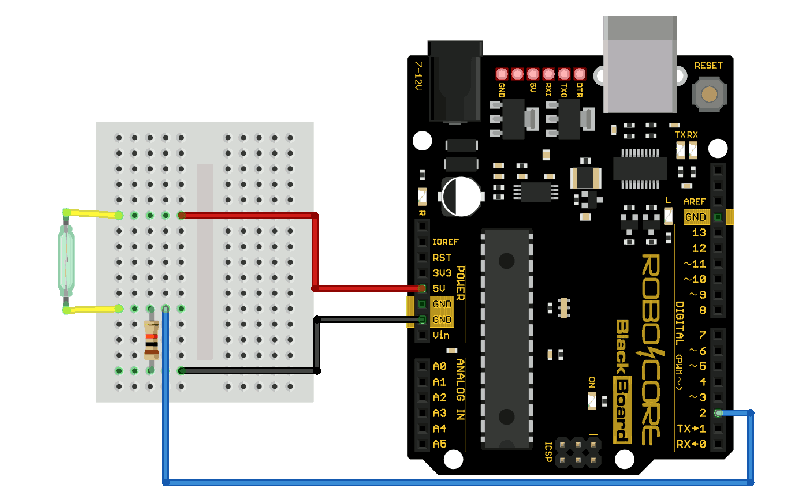
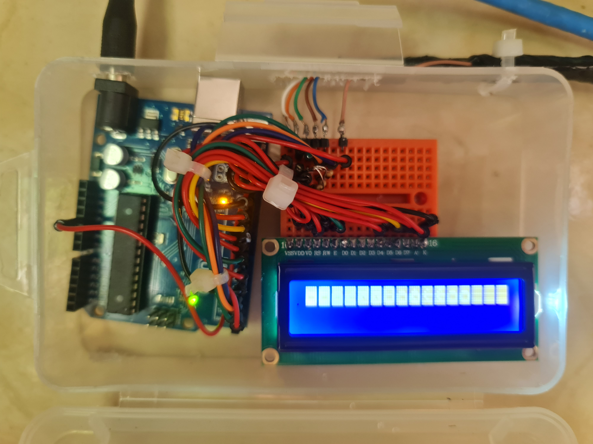

# arduino_water_level
Monitors Water tank levels 

# Lista de items

- 1 Arduino Uno
- Fonte 12v
- 1 Mini Protoboard
- 1 Lcd 16x2 backlight
- 1 Water flow sensor YF-S201
- 3x Sensor de Nivel de Agua (boia) - Baixo, medio, alto
- 3x resistor 10k
- cabo de rede cat6
- Pinos macho 90 graus

> Utilizar resistor entre o gnd e um dos fios da boia.

# Resultado final:

